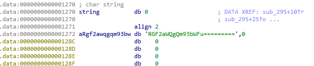

# CyberArk space_enc_mod CTF write-up

In july 2021, CyberArk uploaded a number of CTFs as part a CTF Competition. The space_enc_mod CTF was one of those CTFs. Following is a description of how I solved it. During the process of solving it, I realized I couldn't find any write-ups for that CTF so I decided to write my own. 

## Requirements and Tools

The solution involves numerous tools and techniques, the reader is assumed to have basic knowledge of the following:

1. ELF structure
2. x86-x64 Assembly
3. Linux binary analysis tools
4. Familiarity with Kernel modules and operation

I used the following tools for comparing, analyzing and patching the binary:

1. [HxD](https://mh-nexus.de/en/hxd/) - Hex editor.
2. [010 Editor](https://www.sweetscape.com/010editor/) with [ELF Template](https://www.sweetscape.com/010editor/repository/templates/file_info.php?file=ELF.bt&type=0&sort=) - This was very helpful when traversing through the multiple ELF related structs and also makes it much easier and quicker to patch the binary.
3. [Beyond Compare](https://www.scootersoftware.com/)
4. IDA - nuff said :)

## The Problem

We are given a file with directions to extract the master key from the file (The original story is much more vivid but as the CTF site is now down I was unable to retrieve it. But it goes along the lines of an AI that has turned bad with fun references to the classic "2001: A Space Odyssey").

The original file is given here:

 [space_enc_mod](space_enc_mod) 

## TLDR

The CTF involves many patches to the original binary in order to make it load and run correctly and return the flag. I will describe the reason and logic behind the patches in this write-up, but if you just want to see the final version of the patched file for comparison or other purposes, here it is:

 [space_enc_mod_patched](space_enc_mod_patched) 

If you run it locally, keep in mind you need to run it on a kernel version 5.8 and will still require to patch the *vermagic* value to your specific kernel version.

## Solution Process

### Initial Examination - Section table offset patching

By simple examination of the file it is obvious this is a binary file. 

When examining the strings we find the famous "*vermagic*" string and also many kernel APIs for device handling (e.g. "device_create", "device_destroy", " register_chrdev"). So we can already assume this is a kernel module that is supposed to be loaded, and once loaded, creates a character device we can communicate with. Still, if attempting to load the file, we will encounter an error and will be unable to load it.

Attempting to receive more information on the binary using *readelf* reveals that even thought the ELF header seems valid, the section table certainly does not.

Examining the section table offset in the ELF header the value is set tp 0x11800

This seems wrong since this offset lands us in the middle of some string and not a structure that looks like a section table.

At this point I realized that a reference of a working kernel module would be very valuable to compare with. Luckily, many ko files exist on the system that I could use for comparison. After doing some reading on the [section table structure in the ELF](https://0xax.gitbooks.io/linux-insides/content/Theory/linux-theory-2.html) and comparing to existing ko's, it seems that the section table should start at offset 0x2e29. Once patched, readelf command will be able to parse the section table.

### Module symbol names and vermagic patching

After the initial fixing of the section table offset in the ELF header, the binary can now be parsed using *readelf* but still will not load. Attempting to load the ko will result in unknown or missing required symbols and wrong version. This first error is occurs because all the strings that contains the substring "mod" where patched to "PWN", so we need to patch them back to "mod". This can be seen by simply looking at the imported kernel APIs and realizing all APIs make sense when patched back to "mod".

The version related error is caused whenever a ko that is loaded was compiled for a different version of the kernel than the one currently running. This is determined by comparing the value of the "vermagic" string with the current kernels version (that can be reteived via *uname -r* command).

Looking at the files vermagic value, it looks like a BASE64 encoded string, which indeed it is, and it decodes to: 

**5.8.0-59-generic SMP mod_unload modversions**

This reveals the kernel version the module is supposed to run on. 

For the following loading and debugging process, it is best to continue with the closest version attainable to the aforementioned one in order to prevent unrelated side effects. I was debugging on an Ubuntu VM so I fetched the closest [kernel version](https://kernel.ubuntu.com/~kernel-ppa/mainline/v5.8-rc1/) I could find. In order for the version validation to succeed, I patched the binary's vermagic with my new kernels version:  **5.8.0-050800-generic SMP mod_unload**

### More section table patching

Attempting to load the binary will still fail. Running *readelf -a* on the current version of the binary will reveal that all relocations info look erroneous.

Examining the section tables entries further it looks like the offset and size of some sections are wrong.

I will not go into each specific patch in the section table since there are 26 entries in the table, most of them do not require patching, but using binary analysis tools like 010 ELF Header parser and readelf can make it easier to notice that some of the offsets land in memory that looks obviously wrong, I had to compare the binary to other ko's on the system to better understand how some sections look in the binary and update the offset and sizes accordingly. 

### Static Analysis - The Journey Begins

#### init_module function

After patching all mandatory issues, the driver should be loadable. But it is still not clear what it does or how we should interact with it.

A good point to start static analysis is the *init_module* function.

The init function performs a number of interesting steps.

1. Creating a character device - The *__register_chrdev* function is used to create a new character device. It is recomended to read the full [documentation](https://www.kernel.org/doc/htmldocs/kernel-api/API---register-chrdev.html). But the first parameter to the function is a *file_operations* struct pointer. We will use it to find our function interfaces later.

2. Creating a class for the new device

3. Creating a device on /dev using *device_create* - This creates the file handle to communicate with in */dev/sem*  

4. Checking length of a string in the data section, comparing it to 0x1a and overwriting it with random bytes - This logic may still be unclear since we did not analyze the rest of the code, but what **is** clear from this line and other references of the string, is that the string needs to have a length of 0x1a in order for many of the operations in the driver to complete. On my system, the string was at an offset and the initial code therefore pointed at null.

   

   So my next step was to move the string to the location in the data section that the strings references point to:

   

#### file_operations struct - reading and writing to/from the driver

Next clues to how we should interact with the created device (we now know is located at */dev/sem*) will come from the [file_operations structure](https://elixir.bootlin.com/linux/latest/source/include/linux/fs.h#L2022). The structure should hold pointers to all interface functions used by the driver to communicate with user-space.

Our file_operations structure is located at offset 0x1160 in the data section and looking at the data section with IDA reveals that references to a few functions are located at different offsets. Those offsets correspond to the following offsets in the file_operations struct:

1. The offset at text:0x40 is the read function handler
2. The offset at text:0x140 is the ioctl function handler
3. The offset at text:0x5B0 is the open function handler

At this stage we can understand that the interface to input data to the driver is via ioctl syscall, and reading data from the driver can be done via reading the file node at */dev/sem*

#### Sending IOCTL to the driver

[IOCTL](https://man7.org/linux/man-pages/man2/ioctl.2.html) is a system call used for communication between kernel space and user space. An IOCTL syscall can be performed by a simple C program and also using python bindings like the fcntl python library.

I found a convenient simple tool already written on GitHub and used it:  [ioctl](https://github.com/jerome-pouiller/ioctl)

it is easy to build and exposes all the functionality of the ioctl syscall.

#### Communicating with the driver

I started by loading the driver and verifying that the module is loaded and that the device was created on /dev

I than created four buffer containing the data: "A", "AAA", "B", "BBB" in order to test how the output we receive changes for each input buffer and fed all four buffers into the driver via ioctl.

For each buffer, I performed an ioctl command inserting the buffer and than read the /dev/sem file to get the output from the module.

None of the buffers resulted in any meaningful output, but an important point to notice, is that I get a similar output for all buffers with the similar initial character. **This is a very important observation since it reduces the input range to 256 possible bytes.** 

#### Some more static analysis and patching 

I wrote a small python script to test all possible relevant inputs after my conclusions that only the initial byte is considered. The script simply triggers an ioctl with a buffer of a single byte with all possible byte values (0-255).

 [full_input_range.py](full_input_range.py) 

After running the script and going over all outputs, none of them looks like a meaningful string, so I guessed I am still missing something.

I had to dive deeper into analysis of the drivers operation. I will mention some conclusions here:

1.  In the IOCTL handler function (sub_140) it looks like the function is creating some string and than sending it to another function and compares then output with the ioctls input buffer, this seems complicated and interesting. but on the bottom line, this comparisons result seems to be discarded and not saved for later fetching. The only effect the ioctl handler seems to have on the data or bss section (the data that is saved for later fetching) is the first character of the ioctls input string. This verifies what I already suspected, That the meaningful part of the input is only the first byte of the buffer.

   

2. The *open* function handler (sub_5B0) is s little more complicated than the rest of the functions. It took me some time to fully understand it, and I also used some dynamic debugging to verify my understanding (I used kernel debugging on QEMU to load and run the driver but this is out of the scope of this tutorial).

   The main point is to understand that the final buffer, before returning to the user from kernel space, goes through a 4-level transformation.

   

   We can see that the only return point from the read function goes through said transformation, that consists of *foo2, foo3, foo4 , foo5*.

   Analyzing the foo functions, it seems they are performing the following operations:

   **foo2** - XORing 2 strings 

   **foo3** - XORing 2 strgins

   **foo4**-  SUBtracting a string from a second strings

   **foo5** - ADDing a string to a second string

   **This is interesting, because running those four operations with any two strings, will result in an unchanged input string !**

   Looking further into those four functions, it seems that only the first function (*foo2*) operates on the string that is finally returned, the other three functions perform their operation on the stack and the output is discarded.

With the second important conclusion, it seems that if I find a way run the output string through the other three functions, or completely skip the entire process, I should receive meaningful output from the driver.

With this in mind I patched the first instruction of each of the foo function to *retn* so the functions will effectively do nothing and return immediately upon calling them.

Running my script again I now received multiple inputs that seem to look like actual strings. It looks like the flag is returned when the buffer starts with a byte of value 170 decimal (0xAA).

## Summary

This was a very challenging CTF since it involves understanding in numerous software development and research areas, The process I described here only details the main path to the solution, but in order to find that path I went through many dead ends and had to research and understand a few parts of the code that were very interesting but not so relevant to the solution so I did not include the full analysis here. 

